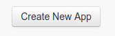
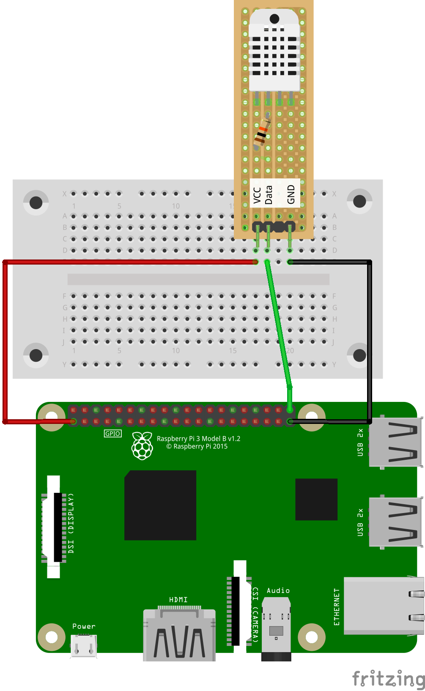
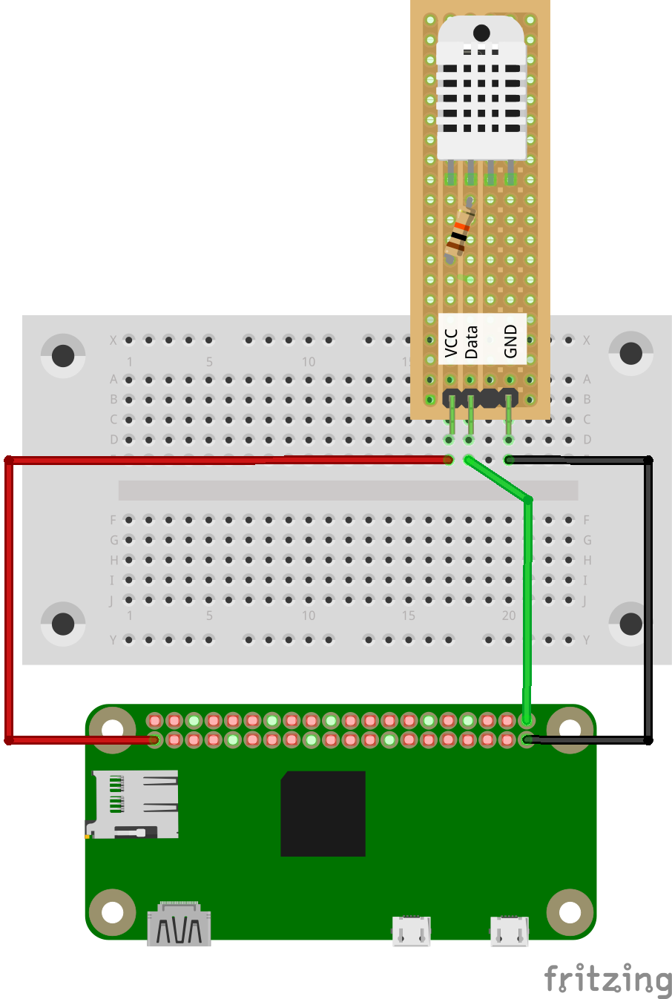

# Raspberry Pi - Twitter Api & Raumklima twittern

## Vorraussetzung

* Twython für Python 3
* Temperatur/Luftfeuchtigkeits-Sensor
* Kabel
* Steckbrett

> für Raspbian Stretch Lite beachte unbedingt die passende Anleitung

## Twython für Python 3 installieren (Raspbian Stretch)
Wir installieren Twython für Python 3.
Du musst online sein, um Pakete zu installieren.

Zunächst bringe dein System auf den aktuellen Stand:
```
sudo apt-get update
sudo apt-get upgrade
```
## Jetzt installieren wir Twython für Python 3:

`sudo pip3 install twython`

Testen Sie, was Sie brauchen, indem Sie die folgenden Befehle eingeben:

`python3 -c "import twython"`

Dies bringt dich zur Eingabeaufforderung ohne Fehler zurück. Wenn du einen Fehler bekommst No module named X, dann prüfe, ob du den Befehl richtig eingegeben hast.

## Raspbian Stretch Lite: Twython für Python 3 installieren
### (Raspberry Pi Zero und alle älteren Modelle Raspberry Pi)

Zunächst bring dein System auf den aktuellen Stand:

```
sudo apt-get update
sudo apt-get upgrade
```

jetzt müssen wir python3 und python3-pip installieren:

`sudo apt-get install python3 python3-pip`

Im Anschluss können wir Twython für Python 3 installieren:

`sudo pip3 install twython`

Testen Sie, was Sie brauchen, indem Sie die folgenden Befehle eingeben:

`python3 -c "import twython"`

Dies bringt dich zur Eingabeaufforderung ohne Fehler zurück. Wenn du einen Fehler bekommst No module named X, dann überprüfe bitte, ob du den Befehl richtig eingegeben hast.

> die weitere Anleitung ist für alle Systeme

## Installieren der Bibliothek von Adafruit für DHT11 & DHT22

`sudo apt-get install build-essential python-dev python-openssl git`

Zuerst laden wir die benötigte Bibliothek von Adafruit.

`git clone https://github.com/adafruit/Adafruit_Python_DHT.git && cd Adafruit_Python_DHT`

Dadurch wird eine Python Bibliothek angelegt, die wir einfach in unsere Projekte einbinden können.
Mit `sudo python3 setup.py install` installieren wir die benötigte Python Bibliothek.

## Twitter-App bei Twitter anlegen
Wenn du noch kein Twitter-Konto hast, dann musst du jetzt ein Twitter-Konto anlegen.

### Lege eine Twitter-App an

Du musst deine deine Twitter-App auf Twitter registrieren, um die notwendigen API-Schlüssel zu bekommen. Die API-Schlüssel sind notwendig, damit du mit Python die Twitter-API(Application Programming Interface) nutzen kannst.

Gehe auf [apps.twitter.com](https://apps.twitter.com) und klicke auf den "Create New App" Knopf.



### Erstelle eine neue App

Fülle die application details aus. Du musst einen application namen, Beschreibung, und eine website (this can be https://www.raspberrypi.org/ wenn du keine Seite besitzt). Lass das Feld 'Callback URL' Feld leer und gehe weiter.

### App details

Ändere die Berechtigungen für deine App von "Read only" in "Read and write".

Klicke jetzt auf den 'Keys and Access Tokens' Reiter und erstelle einen access token.

Wenn du einmal den "create an Access Token button" bestätigt hast. Lade die Seite neu und du solltest deine access token details sehen.

Erstelle eine neue Datei und füge die API-Schlüssel
ein.

```
consumer_key        = 'ABCDEFGHIJKLKMNOPQRSTUVWXYZ'
consumer_secret     = '1234567890ABCDEFGHIJKLMNOPQRSTUVXYZ'
access_token        = 'ZYXWVUTSRQPONMLKJIHFEDCBA'
access_token_secret = '0987654321ZYXWVUTSRQPONMLKJIHFEDCBA'
```

Speichere die Datei unter `auth.py`.

Erstelle eine weitere neue Datei und importiere Twython aus dem twython module:

from twython import Twython
_Importiere die notwendigen Variables aus der `auth.py`_:

from auth import (
    consumer_key,
    consumer_secret,
    access_token,
    access_token_secret
)
Speichere die Datei unter `twitter.py` .

## Aufbau (1 DHT22 Sensor, Raspberry Pi 2 oder 3)



## Aufbau (1 DHT22 Sensor, Raspberry Pi Zero)



Ersetze die Datei `twitter.py`:
```python
#!/usr/bin/python3
import time
import Adafruit_DHT
from twython import Twython
from datetime import datetime


sensor = Adafruit_DHT.DHT11
pin = 21

from auth import (
    consumer_key,
    consumer_secret,
    access_token,
    access_token_secret
)

twitter = Twython(
    consumer_key,
    consumer_secret,
    access_token,
    access_token_secret
)


while 1:
        humidity, temperature = Adafruit_DHT.read_retry(sensor, pin)                   
        if humidity is not None and temperature is not None:

           message  = "Raumklima"
           message  += " am: %s - " %datetime.now ().strftime ('%d.%m.%Y um %H:%M Uhr')
           message  += "Temp: %0.1fC" % (temperature)
           message  += " Luftfeuchte: %0.1f%%" % (humidity)
           time.sleep(600)
           twitter.update_status(status=message)
           print("Tweeted: %s" % message)

        else:
                        print('Fehler beim Einlesen der Daten. Starte einen weiteren Versuch!')

```
Wenn alles passt, sollte nach 10 Minuten der Tweet erscheinen.
